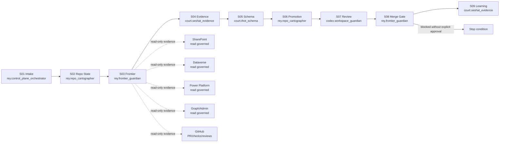

# Multi-Canon Agentic Execution Graph

Estado: `ACTIVE_REPO_LOCAL_20260614`

## Handoff rule

Every edge passes a structured result. The next agent receives only the
artifact, evidence pointers and stop condition needed for its role.

## Surface rule

Read-only evidence may be requested from governed information surfaces when it
prevents inference. Live writes require a separate atomic order and are outside
this engine's default execution mode.
